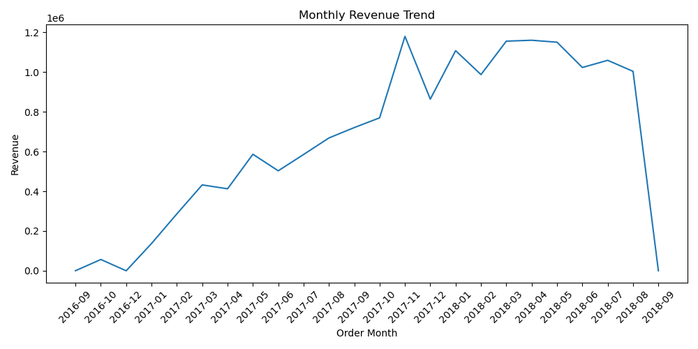
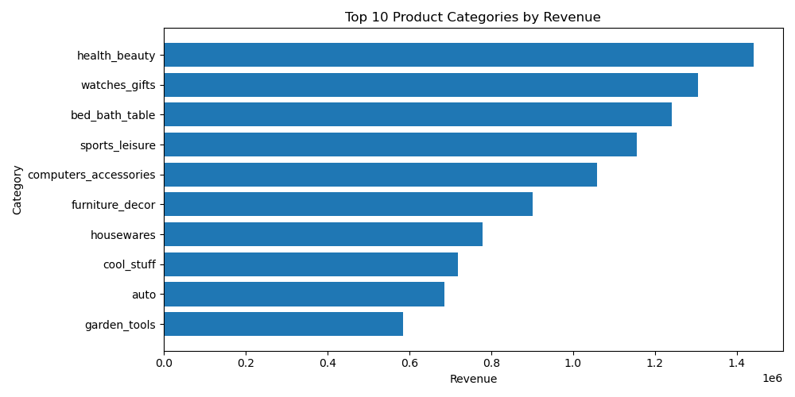
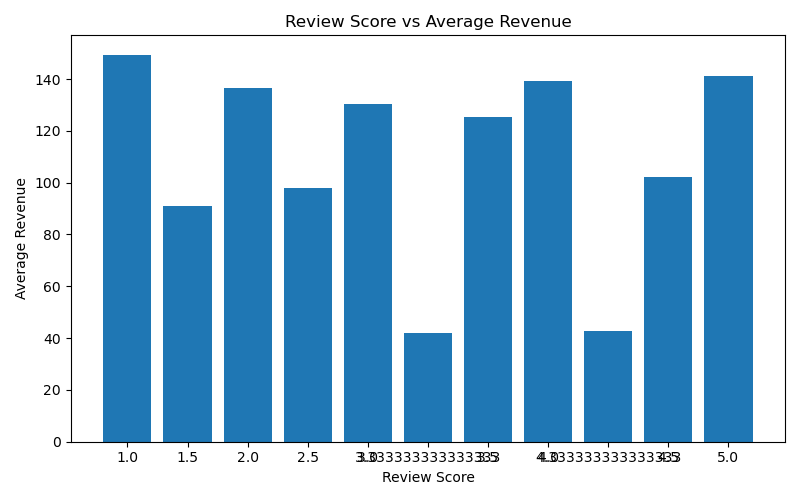
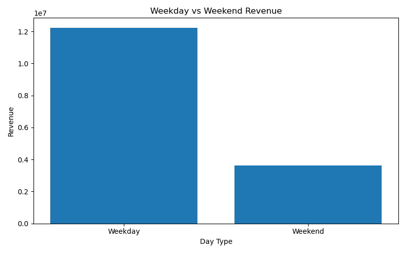
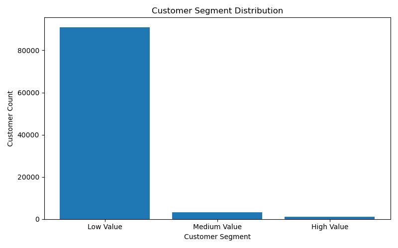
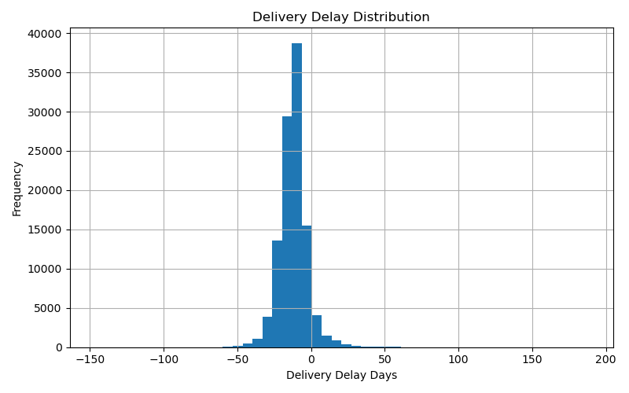

# Olist E-commerce Data Analysis Project

## 📌 Project Overview

This project focuses on cleaning, analyzing, and extracting actionable insights from the **Olist Brazilian E-commerce Dataset**.
The objective is to practice end-to-end data analysis using **Python and SQL** by working with real-world, structured e-commerce data.

The analysis covers multiple aspects of the business, including sales performance, customer behavior, product categories,
seller performance, delivery efficiency, and customer reviews.

---

## 📊 Dataset

The dataset used in this project is the **Olist Brazilian E-commerce Dataset**, which contains real transactional data
from a Brazilian online marketplace.

Main tables used in this project:
- Orders
- Order Items
- Payments
- Reviews
- Customers
- Products
- Sellers
- Product Category Translation (Portuguese → English)

The data was cleaned and merged into a single analytical fact table for further analysis.

---

## 🛠 Tools & Technologies

- **Python** (pandas, matplotlib, seaborn)
- **SQL** (SQLite)
- **Jupyter Notebook**
- **VS Code**
- **Git & GitHub**

---

## 🔄 Project Workflow

1. **Exploratory Data Analysis (EDA)**
   - Inspected data structure, data types, and data quality
   - Identified missing values, duplicates, and inconsistencies

2. **Data Cleaning & Feature Engineering**
   - Converted date columns to datetime format
   - Merged multiple datasets into a unified fact table
   - Created derived features such as revenue, order month, weekday, and delivery delay

3. **SQL Analysis**
   - Imported cleaned data into SQLite
   - Wrote intermediate to advanced SQL queries using:
     - Subqueries
     - Common Table Expressions (CTEs)
     - Window functions
     - CASE-based business logic

4. **Data Analysis & Visualization**
   - Analyzed revenue trends and seasonality
   - Identified top-performing product categories and sellers
   - Explored customer segmentation and review behavior
   - Evaluated operational metrics such as delivery delays

---

## 📈 Key Insights

- Revenue exhibits clear monthly trends and seasonal patterns.
- A small number of product categories contribute a large portion of total revenue (Pareto effect).
- Orders with higher review scores tend to generate higher average revenue.
- High-value customers represent a small portion of the customer base but contribute disproportionately to total revenue.
- Weekday orders generate more revenue than weekend orders.
- Some high-revenue product categories show relatively low review scores, indicating potential operational or quality issues.
- Delivery delays show a skewed distribution, suggesting the presence of logistical outliers.

---

## 📊 Visual Insights

### Monthly Revenue Trend


### Top Product Categories by Revenue


### Review Score vs Revenue


### Weekday vs Weekend Revenue


### Customer Segmentation


### Delivery Delay Distribution


---

## 📁 Project Structure

```text
data-analysis-project/
├── data/
│   ├── raw/                # Original datasets
│   └── processed/          # Cleaned analytical dataset
│
├── notebooks/
│   ├── 01_eda.ipynb        # Exploratory Data Analysis
│   ├── 02_cleaning.ipynb   # Data cleaning and feature engineering
│   └── 03_analysis.ipynb   # Analysis, visualization, and insights
│
├── sql/
│   ├── 01_Monthly_revenue_analysis.sql
│   ├── 02_Monthly_KPI.sql
│   ├── 03_Ranking_category.sql
│   ├── 04_Customer_segmentation.sql
│   ├── 05_Review_score.sql
│   ├── 06_Weekday_vs_Weekend.sql
│   ├── 07_Seller_performance.sql
│   └── 08_Top20%.sql
│
├── outputs/
│   ├── figures/            # Saved visualizations
│   └── summary_tables/     # SQL query outputs
│
├── README.md
└── requirements.txt
