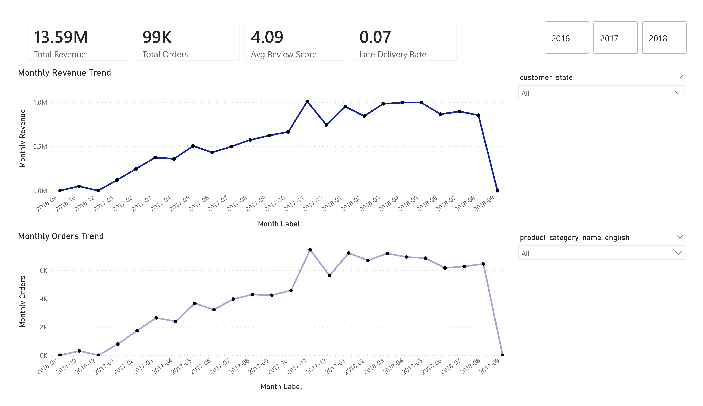
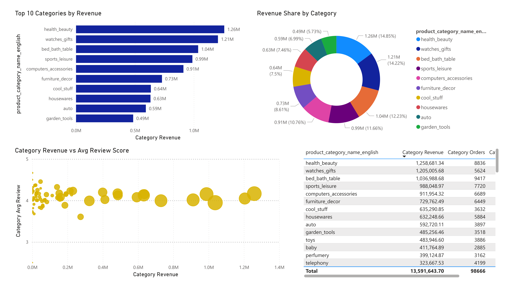
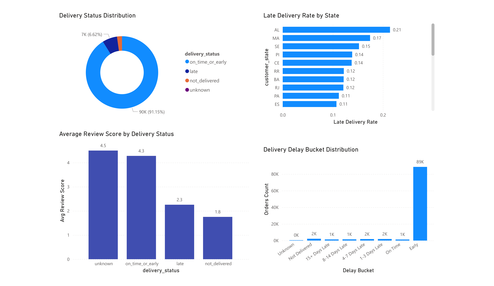
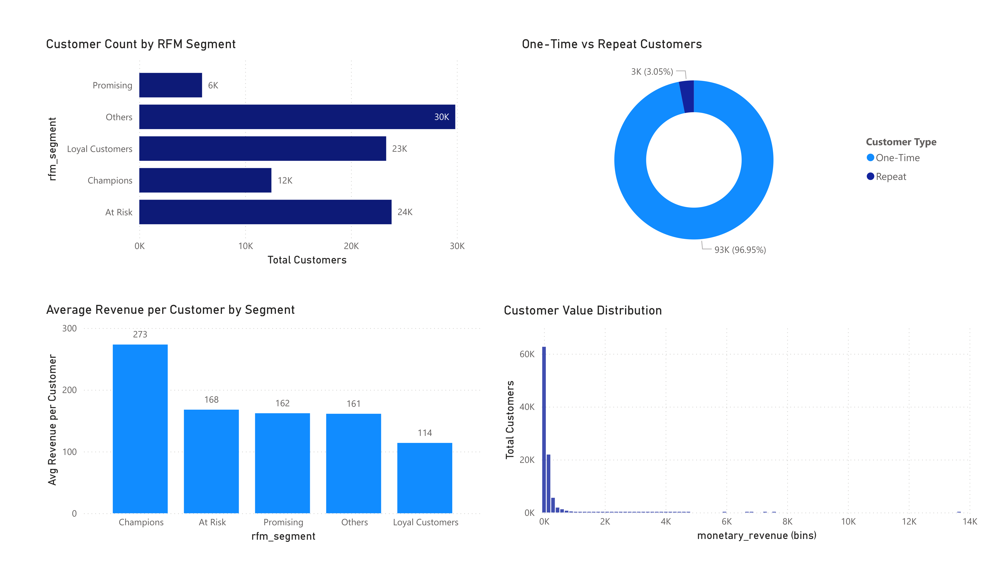

# Olist E-commerce Data Analysis

## Overview

This project analyzes the Brazilian Olist e-commerce dataset to uncover business insights across sales performance, customer behavior, and delivery operations.

The project is designed with an end-to-end data workflow:

* raw data ingestion
* data cleaning and feature engineering
* analytical data modeling (fact/dimension tables)
* SQL-based analysis
* dashboard-ready outputs

The goal is to demonstrate strong data analysis fundamentals, including:

* correct metric definition
* proper handling of data granularity
* reproducible data pipelines
* business-oriented analytical thinking

---

## Key Objectives

* Build a clean analytical dataset from multiple relational tables
* Ensure correct metric computation by separating item-level and order-level logic
* Analyze revenue trends, customer behavior, and delivery performance
* Provide a structured dataset suitable for BI tools (e.g., Power BI)

---

## Dataset

Source: Olist Brazilian E-commerce Public Dataset

Main tables:

* orders
* order_items
* order_payments
* order_reviews
* customers
* products
* sellers
* product_category_name_translation

---

## Project Structure

```
olist-ecommerce-data-analysis/

├── data/
│   ├── raw/                  # Original datasets
│   ├── processed/            # Cleaned dataset (item-level)
│   └── marts/                # Analytical tables (fact/dimension)

├── notebooks/
│   ├── 01_eda.ipynb          # Data exploration
│   ├── 02_cleaning.ipynb     # Cleaning logic walkthrough
│   └── 03_analysis.ipynb     # KPI validation & reasoning

├── scripts/
│   ├── build_processed_data.py
│   ├── build_analytics_mart.py
│   ├── run_analysis.py
│   └── notebook_reference_checks.py

├── sql/                      # Business analysis queries

├── outputs/
│   ├── figures/              # Generated charts
│   └── summary_tables/       # Aggregated results

├── dashboard/
│   ├── exports/              # Dashboard screenshots
│   └── *_notes.md            # Modeling & KPI notes

├── docs/
│   ├── data_quality_notes.md
│   └── metric_modeling_rules.md

├── requirements.txt
└── README.md
```

---

## Data Modeling Approach

### 1. Analytical Grain

The processed dataset is stored at the **order-item level**:

* 1 row = 1 item within an order
* Orders with multiple items appear multiple times

Because of this:

* Business KPIs must be computed at the **order level**
* Product/category analysis remains at the **item level**

---

### 2. Fact Tables

* `fact_sales` → item-level (order item)
* `fact_orders` → order-level (aggregated)

Use:

* `fact_orders` for KPIs (revenue, AOV, delivery, reviews)
* `fact_sales` for category/product analysis

---

### 3. Revenue Definition

Two revenue concepts:

* `revenue` → item-level (price + freight)
* `order_revenue` → aggregated to order level

Primary KPI rule:

* **Use delivered orders only**

This avoids overstating business performance with canceled or incomplete orders.

---

### 4. Key Data Considerations

* `order_total_payment_value` is duplicated across item rows → must not be summed at item level
* Some records contain delivery inconsistencies → explicitly flagged
* Missing values are partly structural (not all are data quality issues)

---

## Key Analyses

### 1. Sales Performance

* Monthly revenue trend (delivered orders)
* Order volume and growth rate
* Average order value (AOV)

### 2. Product & Category Analysis

* Top categories by revenue
* Revenue distribution across product groups
* Pareto contribution (top 20% categories)

### 3. Delivery Performance

* Late delivery rate
* Delivery delay impact on customer reviews
* On-time vs late comparison

### 4. Customer Behavior

* Repeat vs one-time customers
* Customer revenue contribution
* RFM-based segmentation (in marts layer)

---

## Example KPI (Order-Level)

* Total Orders
* Total Delivered Revenue
* Average Order Value (AOV)
* Average Review Score
* Late Delivery Rate

All computed from **order-level aggregation**

---

## How to Run

### 1. Install dependencies

```bash
pip install -r requirements.txt
```

### 2. Build processed dataset

```bash
python scripts/build_processed_data.py
```

### 3. Build analytics mart

```bash
python scripts/build_analytics_mart.py
```

### 4. Run analysis outputs

```bash
python scripts/run_analysis.py
```

### 5. (Optional) Validate notebook logic

```bash
python scripts/notebook_reference_checks.py
```

---

## Dashboard Preview

### Executive Overview
High-level KPIs including total revenue, total orders, average review score, and late delivery rate, along with monthly revenue and order trends.



---

### Product Performance
Top-performing product categories by revenue, revenue share distribution, and the relationship between category revenue and customer satisfaction.



---

### Delivery & Customer Experience
Delivery performance analysis, including late delivery rates by state, delivery status distribution, and the impact of delivery delays on customer reviews.



---

### Customer Segmentation
Customer segmentation using RFM analysis, highlighting customer distribution, repeat behavior, and revenue contribution by segment.



Notes:

* The dashboard is built on top of the marts layer
* `fact_orders` is used for KPI calculations
* `fact_sales` is used for product/category visuals

---

## Key Insights (Example)

* Revenue is heavily concentrated in a small number of categories (Pareto effect)
* Late deliveries negatively impact customer review scores
* Repeat customers contribute disproportionately to total revenue
* Delivered-order filtering provides a more accurate view of business performance

---

## Technical Highlights

* Proper separation of **item-level vs order-level logic**
* End-to-end reproducible data pipeline
* Combination of Python + SQL for analysis
* Star schema modeling for BI readiness
* Explicit handling of data quality and metric assumptions

---

## Limitations

* Dataset is historical and may not reflect real-time business behavior
* Some delivery-related inconsistencies exist in source data
* Customer retention is approximated using order history (no full lifecycle tracking)

---

## Conclusion

This project demonstrates the importance of:

* correct metric definitions
* understanding data granularity
* building clean analytical datasets
* connecting data work to business meaning

It reflects a practical, production-style approach to data analysis rather than a purely exploratory workflow.
