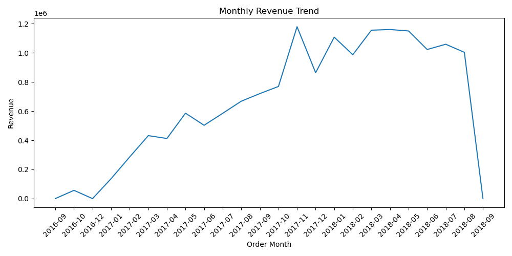
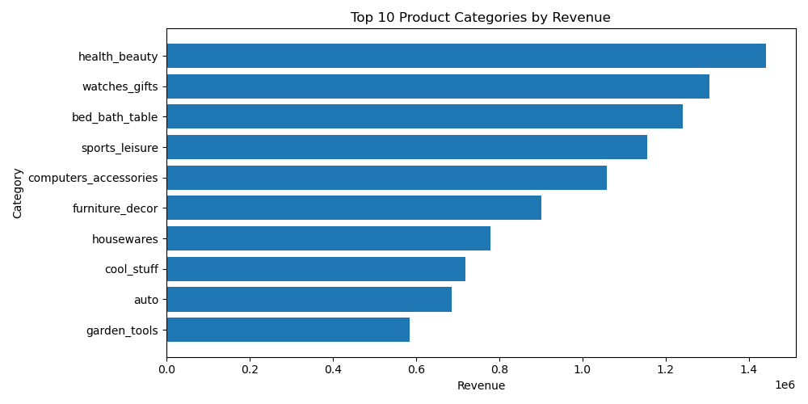
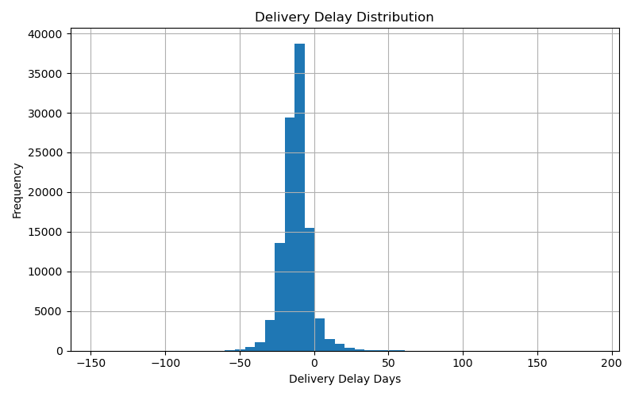
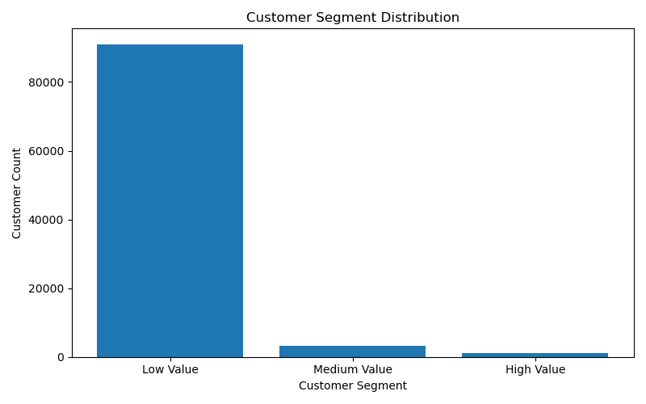
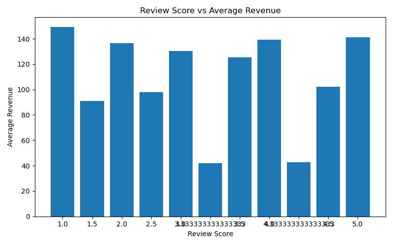
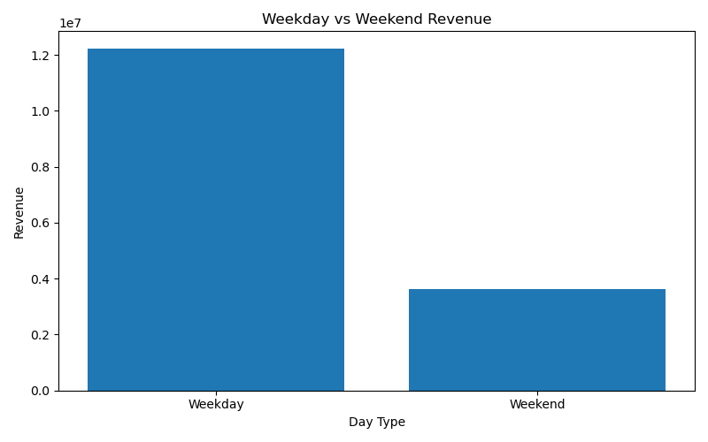

# Olist E‑commerce Data Analysis


## Project Overview

This project performs **exploratory data analysis (EDA) and business analytics** on the **Olist Brazilian E‑commerce dataset**.  
The objective is to transform raw transactional data into meaningful **business insights using SQL, Python, and data visualization**.

The analysis investigates revenue trends, product performance, customer behavior, logistics performance, and seller performance within the marketplace.

The workflow combines **SQL analysis, Python data processing, and visualization** to answer real-world business questions.

---

## Dataset

The project uses the **Olist Brazilian E‑commerce dataset**, which contains transactional data from a Brazilian online marketplace.

Raw datasets are stored in:

```
data/raw/
```

Files used in the analysis:

- `olist_customers_dataset.csv`
- `olist_orders_dataset.csv`
- `olist_order_items_dataset.csv`
- `olist_order_payments_dataset.csv`
- `olist_order_reviews_dataset.csv`
- `olist_products_dataset.csv`
- `olist_sellers_dataset.csv`
- `product_category_name_translation.csv`

These datasets represent customers, orders, payments, products, sellers, and reviews in a relational structure.

---

## Analysis Workflow

The analysis follows a structured workflow:

```
Raw CSV Data
      │
      ▼
Data Cleaning (Python / Pandas)
      │
      ▼
Structured Dataset
(clean_olist_data.csv)
      │
      ▼
SQL Business Analysis
      │
      ▼
Summary Tables
      │
      ▼
Data Visualization
(Matplotlib)
```

Key stages:

1. **Exploratory Data Analysis (EDA)** using Jupyter notebooks
2. **Data cleaning and preparation** using Pandas
3. **SQL-based business analysis**
4. **Visualization of key insights**
5. **Exporting summary tables and charts**

---

## Repository Structure

```
olist-ecommerce-data-analysis-main/
│
├── data/
│   ├── raw/                      # Original Olist CSV files
│   └── processed/
│       ├── clean_olist_data.csv
│       └── olist_analysis.db
│
├── notebook/
│   ├── 01_eda.ipynb              # Initial exploration
│   ├── 02_cleaning.ipynb         # Data cleaning
│   └── 03_analysis.ipynb         # Analysis workflow
│
├── sql/                          # SQL analysis queries
│   ├── 01_Monthly_revenue_and_orders.sql
│   ├── 02_Monthly_KPI.sql
│   ├── 03_Raking_category.sql
│   ├── 04_Customer_segmentation.sql
│   ├── 05_Review_score.sql
│   ├── 06_Weekday_vs_Weekend_performance.sql
│   ├── 07_Seller_performance.sql
│   ├── 08_Top20%.sql
│   ├── 09_Total_revenue.sql
│   └── 10_Revenue_from_top10category.sql
│
├── outputs/
│   ├── figures/                  # Visualization outputs
│   └── summary_tables/           # Aggregated results
│
├── requirements.txt
└── README.md
```

---

## Key Business Questions

The project investigates several key business questions:

- How does **monthly revenue evolve over time**?
- Which **product categories generate the highest revenue**?
- How do **customer reviews relate to revenue performance**?
- Are there **differences between weekday and weekend sales**?
- What is the **distribution of delivery delays**?
- How is **revenue distributed among sellers and customers**?

---

## Example Visual Insights

### Monthly Revenue Trend



Shows how total marketplace revenue evolves over time.

---

### Top Product Categories by Revenue



Identifies which product categories contribute the most revenue.

---

### Delivery Delay Distribution



Analyzes logistics performance and shipping delays.

---

### Customer Segment Distribution



Shows how revenue or orders are distributed across customer groups.

---

### Review Score vs Revenue



Examines the relationship between customer satisfaction and revenue.

---

### Weekday vs Weekend Performance



Compares marketplace performance between weekdays and weekends.

---

## Generated Summary Tables

Aggregated results are exported to:

```
outputs/summary_tables/
```

Examples:

- Monthly KPI metrics
- Category revenue rankings
- Customer segmentation
- Seller performance
- Top revenue contributors

These tables support further analysis or dashboard development.

---

## Tech Stack

- **Python**
- **Pandas**
- **NumPy**
- **SQL**
- **SQLite**
- **Matplotlib**
- **Jupyter Notebook**

---

## Skills Demonstrated

- Exploratory Data Analysis (EDA)
- Data cleaning and transformation
- SQL analytical queries
- Business metrics analysis
- Data visualization
- Translating raw data into actionable insights

---

## Portfolio Relevance

This project demonstrates practical **data analyst skills**, including:

- Investigating business performance using real-world e‑commerce data
- Writing analytical SQL queries
- Building visualizations to communicate insights
- Structuring a reproducible data analysis workflow

These skills are essential for **data analyst and data analytics internship roles**.

---

## Author

**Bright**  
Computer Engineering Student
